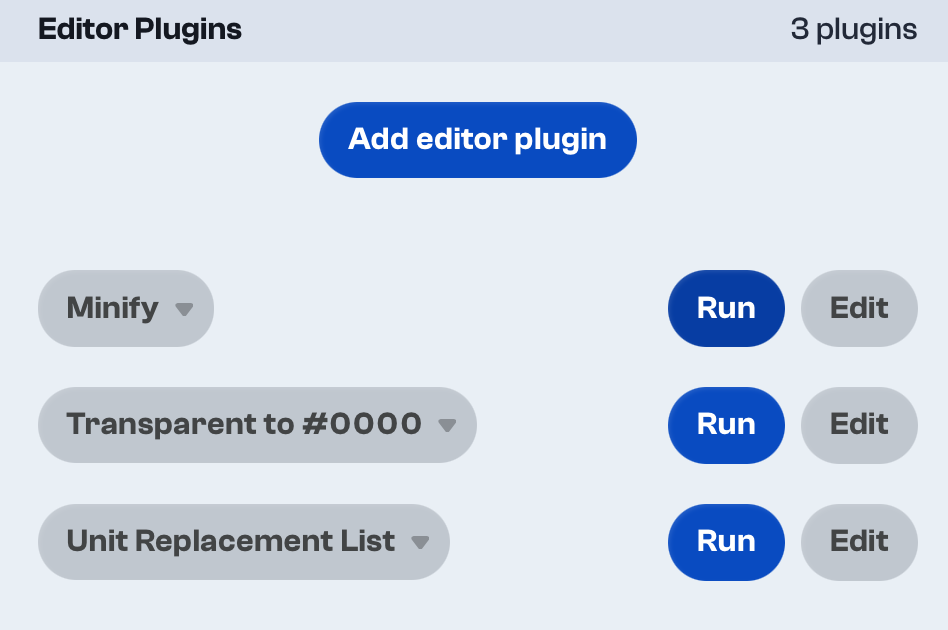
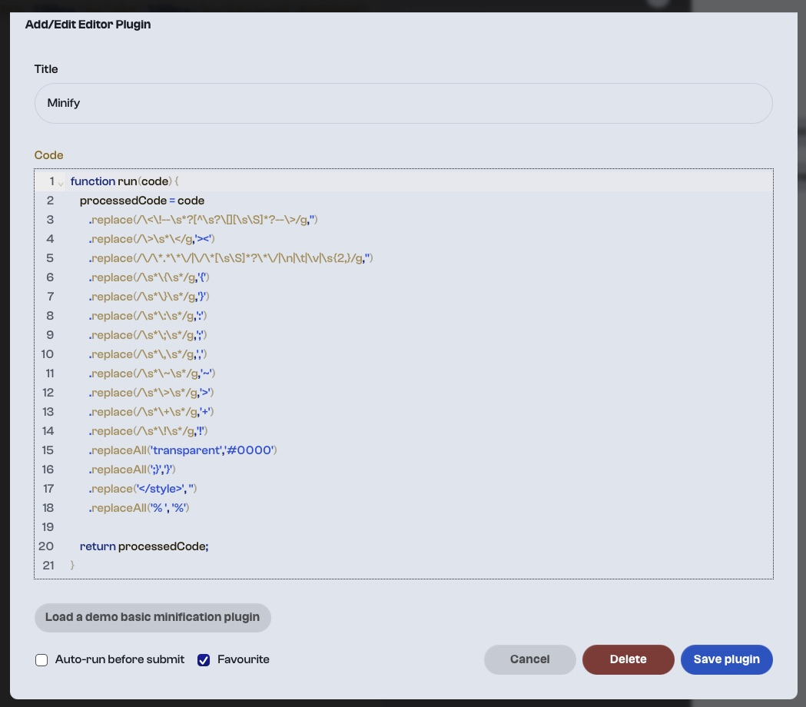

# artlung-cssbattle-plugins

I play **[CSSBattle](https://cssbattle.dev/)** regularly. I've been a top 100 player for a few months and I enjoy it as a "Code Golf" challenge and to learn markup and CSS tricks. It's pretty fun for me.

Here are a few of them. They may ruin your code! Or maybe they'll help you win. Who can say.

## Usage

There's a "Plugins" button in the main interface. Click it to open the Plugins sidebar which looks like this:

Cut and paste the body of the `js` file you'd like to try and save. You can set it as a "Favorite" if you click the "Favourite" checkbox.

There's also an option to automatically run the plugin but I've not found that to be particularly useful.

## Caveats

This code may indeed ruin your solution. The way I code might not match how you code. I tend to code with html markup first, then a style block, with no closing `</style>` tag. A `<body>` tag is implicit in the default board. If you have ideas for a plugin but dopn't have the programming experience to make it, feel free to add a feature request as an issue.

